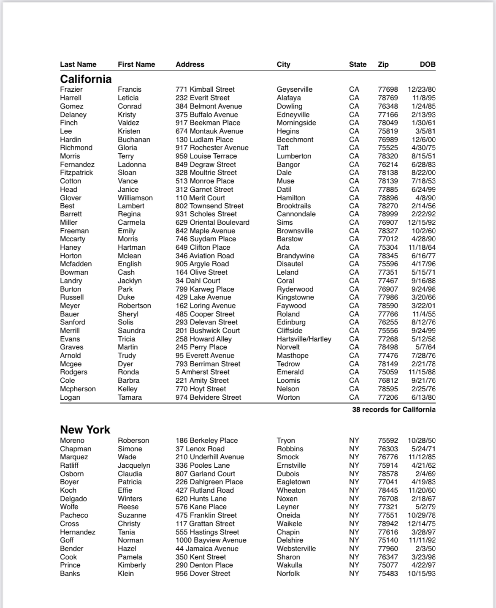

<p align="center">
    
</p>
<p align="center">
    
    
    
</p>

A SwiftUI inspired framework for generating reports and other PDF documents.

##  Look Ma, no Commands
PDFBlocks uses a declarative language for describing document layout. There is no print(), draw(), newPage() or any other 
kind of print command. Instead, you specify the elements you want to appear within a layout heirarchy. Here is the "code"
used to generate the PDFBlocks logo used at the top of this document:
```swift
struct Document: Block {
    var body: some Block {
        VStack(spacing: .pt(2)) {
            HStack(spacing: .pt(2)) {
                ForEach(["P", "D", "F"]) { item in
                    LetterBlock(letter: item, color: .red)
                }
            }
            HStack(spacing: .pt(2)) {
                ForEach(["B", "L", "O", "C", "K", "S"]) { item in
                    LetterBlock(letter: item, color: .cyan)
                }
            }
        }
    }
}

struct LetterBlock: Block {
    let letter: String
    let color: Color
    var body: some Block {
        Text(letter)
            .foregroundColor(.white)
            .frame(width: .pt(48), height: .pt(48), alignment: .center)
            .background { color }
            .font(name: "American Typewriter", size: 36)
            .bold()
    }
}
```

## Easy to write reports.
Define your table columns. Define grouping criteria with headers and footers. PDFBlocks takes care of the rest.
```swift
struct Document: Block {
    let data: [Donor]

    var body: some Block {
        Table(data) {
            TableColumn("Last Name", value: \.lastName, width: 20)
            TableColumn("First Name", value: \.firstName, width: 20)
            TableColumn("Address", value: \.address, width: 35)
            TableColumn("City", value: \.city, width: 25)
            TableColumn("State", value: \.state, width: 10)
            TableColumn("Zip", value: \.zip, width: 10)
            TableColumn("DOB", value: \.dob, format: .mmddyy, width: 10, alignment: .trailing)
        } groups: {
            TableGroup(on: \.state, order: <, spacing: .pt(12)) { rows, value in
                Text(stateName(abberviation: value))
                    .font(size: 14)
                    .bold()
            } footer: { rows, value in
                Divider()
                Text("\(rows.count) records for \(stateName(abberviation: value))")
                    .bold()
                    .padding(.leading, .max)
            }
        }
    }
}

let pdfData = Document().renderPDF(pageSize: .letter, margins: .in(1))

```
<p align="center">
    
</p>

## SwiftUI Inspired
PDFBlocks is inspired by SwiftUI and follows its syntax closely, however, there are some differences to be aware of.
### Blocks
Everything in SwiftUI that is a View is a Block in PDFBlocks.

* Components such as Text, Image, Color, Divider, VStack, HStack, ZStack, Page, and Table are all blocks. 
* Modifiers like .font, .foregroundColor, .opacity, .padding, ,border, .frame, .background, and .overlay are blocks as well.
* Documents you write are blocks.
* Re-usable components you compose are blocks.

### Units
Sizes must be specified in points (.pt), inches (.in), or milimeters (.mm). 
```swift
    Color.blue
        .frame(width: .in(1), height: .pt(72))
```
### Frames
There is no minWidth, maxWidth, minHeight, maxHeight for frames. Instead, a width or height can be set as .max.
So, instead of this SwiftUI code for positioning an element in the bottom trailing corner of a view:
```swift
Text("Bottom Trailing Text in SwiftUI)
    .frame(maxWidth: .infinity, maxHeight: .infinity, alignment: .bottomTrailing)
```
You would use:
```swift
Text("Bottom Trailing Text in PDFBlocks)
    .frame(width: .max, height: .max, alignment: .bottomTrailing)
```
Or alternatively you could use:
```swift
Text("Bottom Trailing Text in PDFBlocks)
    .padding([.top, .leading], .max)
```

### Spacing
Instead of using a Spacer block, you can set stack spacing as .flex. The following will give equal spacing between
elements:
```swift
HStack(spacing: .flex) {
    Text("One Fish")
    Text("Two Fish")
    Text("Red Fish")
    Text("Blue Fish")
}
```
### Alignment
Default alignment in SwiftUI is centered. In PDFBlocks it is top leading.

### Pages
A document with multiple pages can be defined like this:
```swift
struct Document: Block {
    Page {
        ...
    }
    Page {
        ...
    }
}
let data = Document().renderPDF(pageSize: .letter, margins: .in(1))
```
Page size can be supplied by the .renderPDF function, but can also be defined within
the document itself. A single document can even have pages of differing sizes:
```swift
struct Document: Block {
    Page(size: .letter, margins: .in(1)) {
        ...
    }
    Page(size: .a4, margins: .mm(24)) {
        ...
    }
}
let data = Document().renderPDF()
```

## Installation
PDFBlocks is distributed using the [Swift Package Manager](https://swift.org/package-manager). To install it into a project, add it as a dependency within your `Package.swift` manifest:

```swift
let package = Package(
    ...
    dependencies: [
        .package(url: "https://github.com/dkyowell/pdfblocks.git", from: "0.1.0-alpha")
    ],
    ...
)
```

Then import PDFBlocks wherever you’d like to use it:

```swift
import PDFBlocks
```
## For a Quick "Preview"
1. Download the PDFBlocks project.
2. Open Package.swift in XCode.
3. Navigate to Sources/PDFBlocks/Examples
4. Puruse the sample documents. Modify them if you wish, and see the results right away using Xcode Previews.

<p align="center">
    
</p>

## Usage Warnings
This is an early release. It is completely usable as-is, but the API will change between releases.

I advise against using San Francisco family fonts. These send the minimum PDF file size up to around 5MB. I do not know why.

## Contributions and Support
Open an issue with questions or feature requests.

See [Contributions.md](Contributions.md) for information about contributions.
