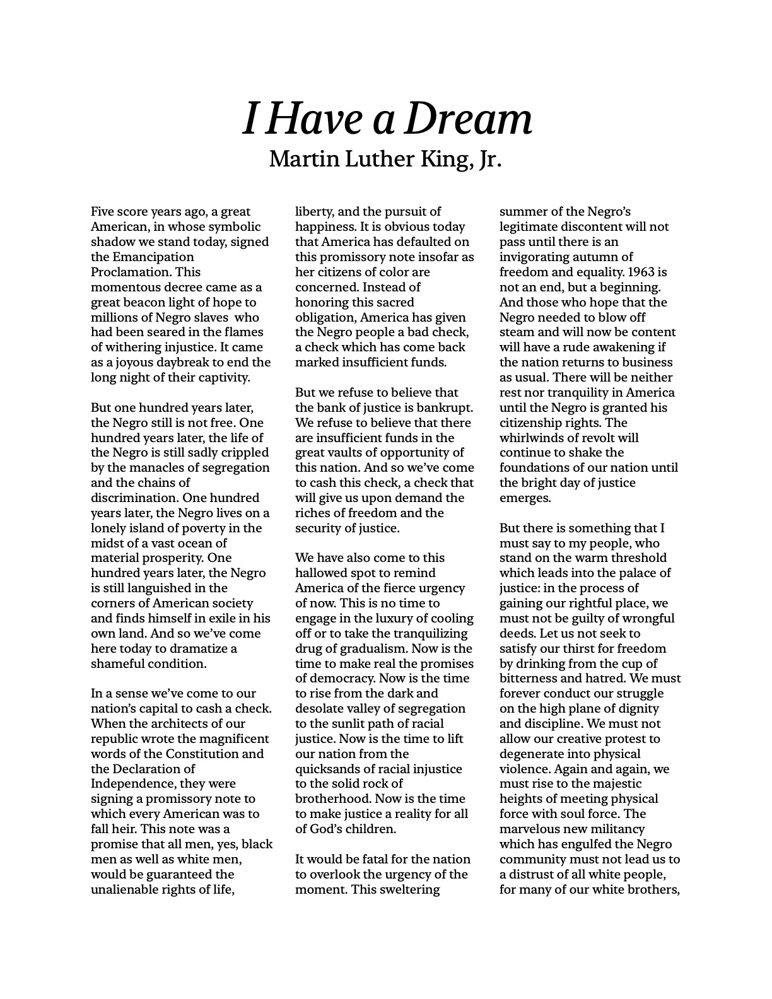
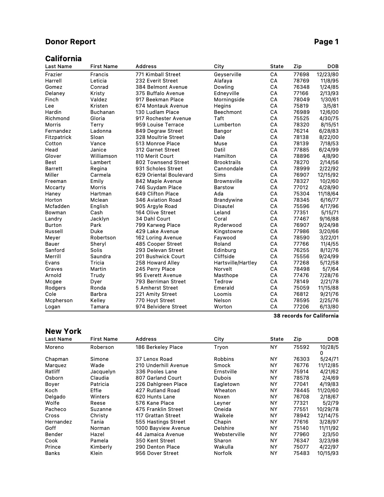
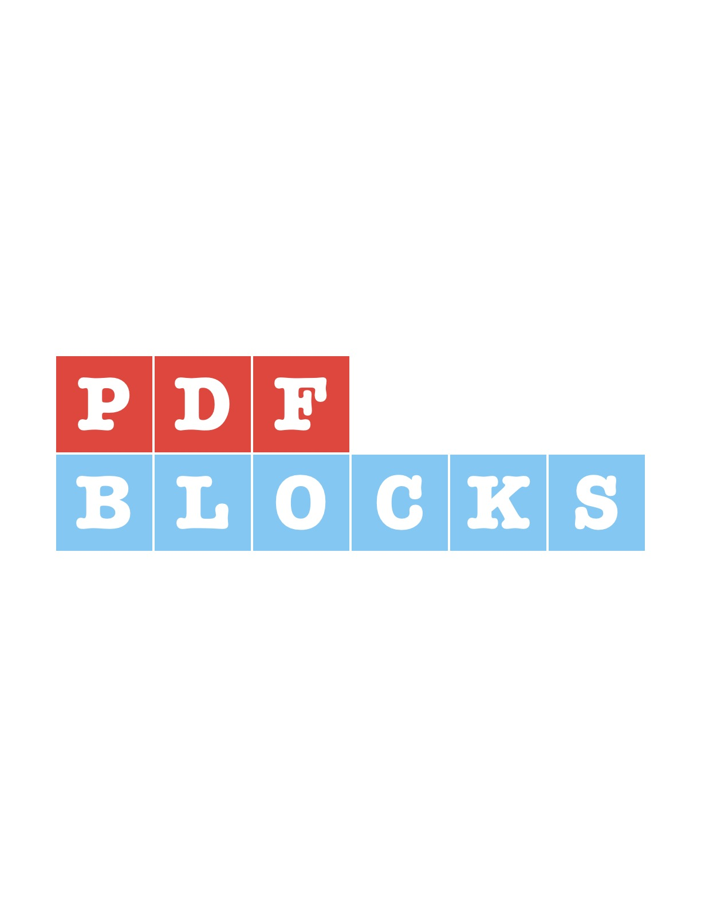
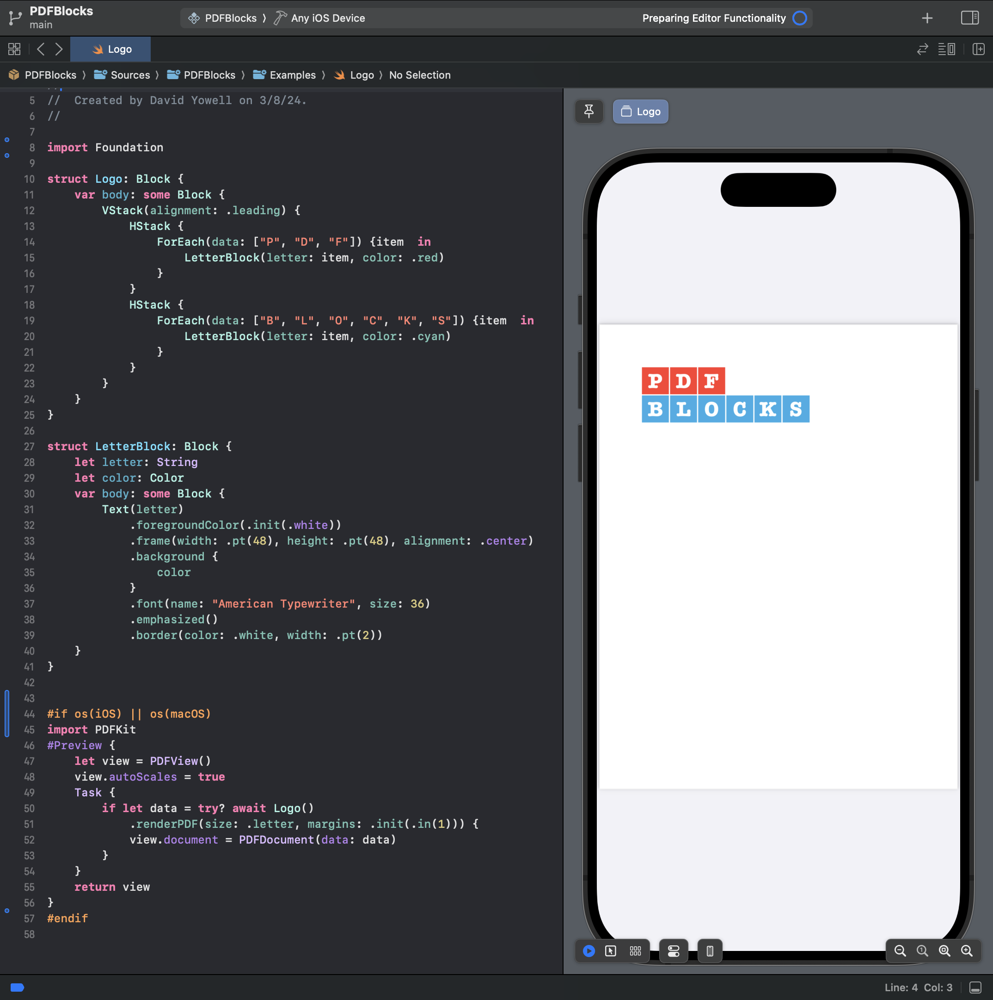

<p align="left">
    
</p>
<p align="left">
    
    
    
</p>

PDFBlocks is a powerful but easy to use PDF document and report generation library written in Swift for Apple platforms. Inspired by SwiftUI, it allows documents to be expressed with a declarative syntax. You just declare what you want printed within appropriate layout structures, and PDFBlocks takes care of positioning, pagination, and all the rest.

## Sample Documents. 

These sample documents and accompanying code provide examples of some of some of the layout capabilities of PDFBlocks.

<table>
  <tr>
     <th>Columns</th>
     <th>Stack Layout</th>
     <th>Report</th>
  </tr>
  <tr>
     <td><a href="Documentation/example-columns.pdf"></a></td>
     <td><a href="Documentation/example-stacks.pdf"></a></td>
     <td><a href="Documentation/example-report.pdf"></a></td>
  </tr>
  <tr>
     <th><a href="Documentation/example-columns.md">Code</a></th>
     <th><a href="Documentation/example-stacks.md">Code</a></th>
     <th><a href="Documentation/example-report.md">Code</a></th>
  </tr>
</table>
<table>

  <tr>
     <th>Vector Drawing</th>
     <th>Gradient Fill</th>
     <th>Custom Components</th>
  </tr>
  <tr>
     <td><a href="Documentation/example-vector.pdf"></a></td>
     <td><a href="Documentation/example-gradient.pdf"></a></td>
     <td><a href="Documentation/example-custom.pdf"></a></td>
  </tr>
  <tr>
     <th><a href="Documentation/example-vector.md">Code</a></th>
     <th><a href="Documentation/example-gradient.md">Code</a></th>
     <th><a href="Documentation/example-custom.md">Code</a></th>
  </tr>
</table>


## Live Previews
PDFBlocks works very well with Xcode Previews. Instantly see your document rendered as a PDF as you code.

<p align="center">
    
</p>


Xcode Previews ia also a great way to get a quick start with PDFBlocks before installing it into your own project.

1. Download the PDFBlocks project.
2. Open Package.swift in Xcode.
3. Navigate to Examples directory
4. Select scheme PDFBlocks-Package or PDFBlocksExamples
4. Puruse the example documents. Modify them if you wish and see the results within Xcode.


## Documentation
[Documentation.md](Documentation/Documentation.md)


## Installation
PDFBlocks is distributed using the [Swift Package Manager](https://swift.org/package-manager). To install it into a project, add it as a dependency within your `Package.swift` manifest:

```swift
let package = Package(
    ...
    dependencies: [
        .package(url: "https://github.com/dkyowell/pdfblocks.git", from: "0.2.4")
    ],
    ...
)
```

Then import PDFBlocks wherever you’d like to use it:

```swift
import PDFBlocks
```

## Roadmap
[Roadmap.md](Documentation/Roadmap.md)

## Beta Release
This is a beta release. The API and layout heuristics could change up until the 1.0 release.

## Support
Open an issue with questions or feature requests. I am actively developing this project and will try to accomodate requests that fit within the goals of the project. You can also send me an email at dkyowell.opensource@gmail.com.
